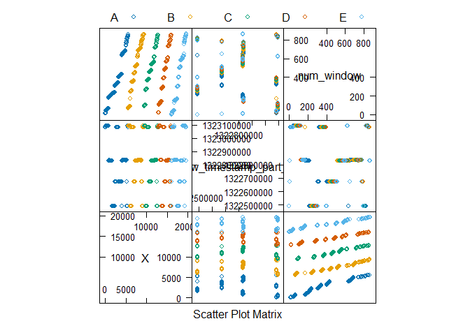
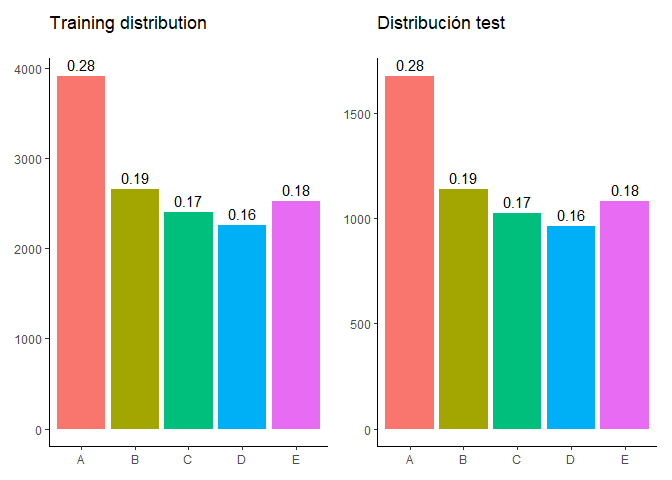
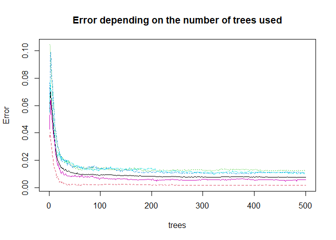
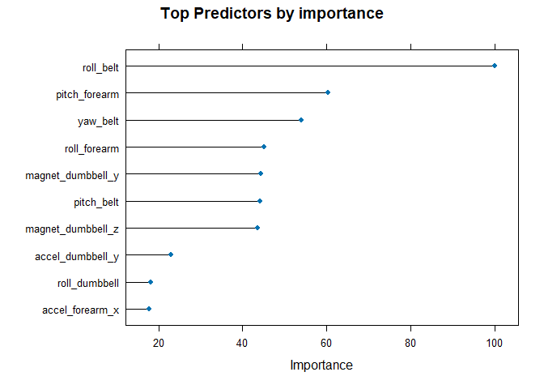
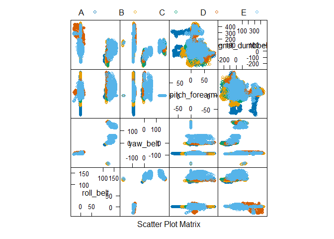

# Aim

Classification and prediction of the quality of physical exercise based
on data obtained from devices that monitor activity. The data has been
collected and shared by [Human Activity
Recognition](http://web.archive.org/web/20161224072740/http:/groupware.les.inf.puc-rio.br/har),
specifically those related to the weight lifting, obtained from
accelerometers located on the belt, forearm, arm and dumbbell of 6
participants.

The exercises were performed in 5 different ways:

-   According to specification (Class A)

-   Bringing the elbows forward (Class B)

-   Lifting the dumbbell only halfway (Class C)

-   Lowering the dumbbell only halfway (Class D)

-   Throwing the hip forward (Class E).

A supervised classification algorithm will be used on the training data
provided to generate a model that allows us to identify the quality of
the exercise performed from the data provided by the devices during the
exercise.

# A first look at the data

We perform a first inspection of the data to detect anomalies and
biases.

``` r
str(training[c(1:13,length(training))])
```

    ## 'data.frame':    19622 obs. of  14 variables:
    ##  $ X                   : int  1 2 3 4 5 6 7 8 9 10 ...
    ##  $ user_name           : chr  "carlitos" "carlitos" "carlitos" "carlitos" ...
    ##  $ raw_timestamp_part_1: int  1323084231 1323084231 1323084231 1323084232 1323084232 1323084232 1323084232 1323084232 1323084232 1323084232 ...
    ##  $ raw_timestamp_part_2: int  788290 808298 820366 120339 196328 304277 368296 440390 484323 484434 ...
    ##  $ cvtd_timestamp      : chr  "05/12/2011 11:23" "05/12/2011 11:23" "05/12/2011 11:23" "05/12/2011 11:23" ...
    ##  $ new_window          : chr  "no" "no" "no" "no" ...
    ##  $ num_window          : int  11 11 11 12 12 12 12 12 12 12 ...
    ##  $ roll_belt           : num  1.41 1.41 1.42 1.48 1.48 1.45 1.42 1.42 1.43 1.45 ...
    ##  $ pitch_belt          : num  8.07 8.07 8.07 8.05 8.07 8.06 8.09 8.13 8.16 8.17 ...
    ##  $ yaw_belt            : num  -94.4 -94.4 -94.4 -94.4 -94.4 -94.4 -94.4 -94.4 -94.4 -94.4 ...
    ##  $ total_accel_belt    : int  3 3 3 3 3 3 3 3 3 3 ...
    ##  $ kurtosis_roll_belt  : chr  "" "" "" "" ...
    ##  $ kurtosis_picth_belt : chr  "" "" "" "" ...
    ##  $ classe              : chr  "A" "A" "A" "A" ...

We graphically see a sample of relationships between variables.



It seems necessary to purge the data set as follows:

-   Some columns will be factors: username, classe

-   The observations are ordered by class and timestamp, making the best
    indicator to classify the date, something meaningless. We remove
    references to the order: X, window, timestamps, …

-   Some communes are empty, are only reported in some cases or have
    erroneous data (DIV0). We will remove them, leaving only factorial
    and numerical variables.

# Model selection

The model we will use will be Random Forest. It allows the
classification of a large number of predictor variables, with high
precision, low variance and little overfitting. The information it
provides on the importance of the variables will give us an idea of ​​the
characteristics of the model. As a negative we will have the execution
time, acceptable with the volume of data that we will use.

We will check the results with a test data set that will be 30% of the
data provided, chosen randomly on the Classe variable and verifying a
consistent distribution of this variable with the training data.

``` r
set.seed(2004)
inTrain = createDataPartition(training_wk$classe, p = 0.7, list = FALSE)
training_wk_entr = training_wk[ inTrain,]
training_wk_test = training_wk[-inTrain,]
```



We will improve the accuracy by using the K-fold cross-validation method
(k=10).

``` r
set.seed(2212)
modelo_rf <- train(classe ~ ., method = "rf", data = training_wk_entr, trControl = trainControl(method = "cv", number = 10))

modelo_rf
```

    ## Random Forest 
    ## 
    ## 13737 samples
    ##    53 predictor
    ##     5 classes: 'A', 'B', 'C', 'D', 'E' 
    ## 
    ## No pre-processing
    ## Resampling: Cross-Validated (10 fold) 
    ## Summary of sample sizes: 12364, 12362, 12362, 12365, 12363, 12362, ... 
    ## Resampling results across tuning parameters:
    ## 
    ##   mtry  Accuracy   Kappa    
    ##    2    0.9907551  0.9883041
    ##   29    0.9912640  0.9889491
    ##   57    0.9852214  0.9813033
    ## 
    ## Accuracy was used to select the optimal model using the largest value.
    ## The final value used for the model was mtry = 29.

# Results

The precision we obtain is greater than 99%, using 29 out of 53
predictors and 500 decision trees.

``` r
modelo_rf$final
```

    ## 
    ## Call:
    ##  randomForest(x = x, y = y, mtry = param$mtry) 
    ##                Type of random forest: classification
    ##                      Number of trees: 500
    ## No. of variables tried at each split: 29
    ## 
    ##         OOB estimate of  error rate: 0.75%
    ## Confusion matrix:
    ##      A    B    C    D    E class.error
    ## A 3900    4    1    0    1 0.001536098
    ## B   24 2625    8    1    0 0.012415350
    ## C    0   15 2370   11    0 0.010851419
    ## D    0    0   22 2228    2 0.010657194
    ## E    0    2    4    8 2511 0.005544554

We can see graphically how the error evolves with the number of trees
that make up the model. Data that we could eventually use to tune the
model.



Now we check our model on the test data, which we had previously set
aside, and thus verify the reliability of what was done. The result
obtained maintains a precision greater than 99%, aligned with the data
we already had and making us think that it is too bad we did not do it.

``` r
predic_rf <- predict(modelo_rf, newdata = training_wk_test)

confusionMatrix(predic_rf, training_wk_test$classe)
```

    ## Confusion Matrix and Statistics
    ## 
    ##           Reference
    ## Prediction    A    B    C    D    E
    ##          A 1671    5    0    0    0
    ##          B    2 1125    3    0    0
    ##          C    0    8 1019    7    0
    ##          D    0    1    4  956    0
    ##          E    1    0    0    1 1082
    ## 
    ## Overall Statistics
    ##                                           
    ##                Accuracy : 0.9946          
    ##                  95% CI : (0.9923, 0.9963)
    ##     No Information Rate : 0.2845          
    ##     P-Value [Acc > NIR] : < 2.2e-16       
    ##                                           
    ##                   Kappa : 0.9931          
    ##                                           
    ##  Mcnemar's Test P-Value : NA              
    ## 
    ## Statistics by Class:
    ## 
    ##                      Class: A Class: B Class: C Class: D Class: E
    ## Sensitivity            0.9982   0.9877   0.9932   0.9917   1.0000
    ## Specificity            0.9988   0.9989   0.9969   0.9990   0.9996
    ## Pos Pred Value         0.9970   0.9956   0.9855   0.9948   0.9982
    ## Neg Pred Value         0.9993   0.9971   0.9986   0.9984   1.0000
    ## Prevalence             0.2845   0.1935   0.1743   0.1638   0.1839
    ## Detection Rate         0.2839   0.1912   0.1732   0.1624   0.1839
    ## Detection Prevalence   0.2848   0.1920   0.1757   0.1633   0.1842
    ## Balanced Accuracy      0.9985   0.9933   0.9950   0.9953   0.9998

Finally we review the importance of the predictors when making the
estimates. It is striking that the main predictors refer to the Euler
angles of the belt (how the orientation of the belt varies over its own
reference system) and the data from the dumbbell accelerometer.



We reviewed the relationship of the most important predictors with each
other to identify possible biases that we were unable to appreciate. I
don’t see anything striking.


